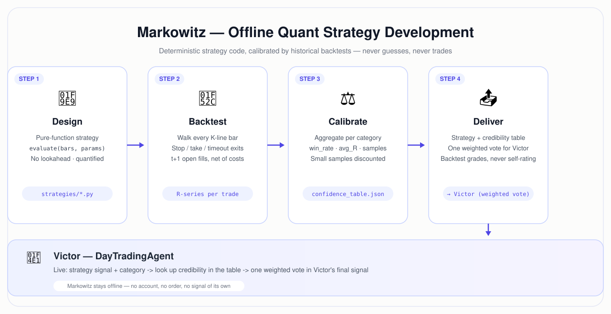

  

<h1 align="center">Markowitz — Quant Strategy Agent (HK / US Equities)</h1>

  
  
  
  
  

🌐 <a href="README_cn.md">简体中文</a>

**Markowitz** is a personified AI agent dedicated to **quantitative strategy development** for Hong Kong and US equities, built on [Claude Code](https://claude.com/claude-code). It designs backtestable trading strategies as deterministic code, runs them against years of historical data to calibrate their credibility, and hands the result to **Victor** — the day-trading agent ([DayTradingAgent](https://github.com/xhqing/DayTradingAgent)) — as one weighted, quantified vote among Victor's many inputs.

> This repository is the **public face** of the Markowitz project: the agent's operating discipline (CLAUDE.md), methodology, and open components. The active intraday research lives in a **private repository** (see [Repository Landscape](#repository-landscape)) — publishing an execution-layer edge would be self-defeating, and knowing what to keep private is part of the craft.

---

## Core Methodology

The edge comes from mathematical rigor that can be reproduced:

- **Fully quantified output.** Every field is a number or a finite enum — no qualitative prose ("momentum weakening"). This is what separates quant from discretionary.
- **Backtest-validated credibility.** A strategy does not grade itself; its confidence comes from historically measured win-rate / avg-R of its signal category.
- **Pure functions, no lookahead.** Same bars + same params → same output, always. No future data leaks into a decision.
- **Honest negative results.** Falsified ideas are documented, not buried — see the "already falsified" section of any strategy doc (e.g. [Swing's STRATEGY.md](https://github.com/xhqing/Swing/blob/main/swing/STRATEGY.md)).
- **Walk-forward, multi-year validation.** In-sample means nothing; out-of-sample with zero degradation is the bar.

  

## Repository Landscape

| Repository | Visibility | What it is |
|---|---|---|
| **[Swing](https://github.com/xhqing/Swing)** | public | Day-K trend-following strategy — **complete documentation**: logic, params, 20-year × 37-stock backtest, honest caveats, falsified alternatives |
| **[gridtrader](https://github.com/xhqing/gridtrader)** | public | Grid-trading strategy development & backtesting tool (Python / backtrader) |
| **[DayTradingAgent](https://github.com/xhqing/DayTradingAgent)** | public | Victor — the day-trading agent that consumes Markowitz's weighted votes |
| Intraday | private | Active intraday research (execution-layer edge). Kept private by design. |

## Relationship to Victor (DayTradingAgent)

| | Markowitz (this repo) | Victor ([DayTradingAgent](https://github.com/xhqing/DayTradingAgent)) |
|---|---|---|
| **Job** | Design & backtest quant strategies | Watch the market & emit trading signals |
| **Mode** | Offline, deterministic code | Real-time, LLM judgment |
| **Output** | Strategy code + credibility table | 🟢/🔴/🟡/🟠 signals for human execution |
| **Touches account?** | No — never | No — signal mode only |

Markowitz's product is **one weighted input** to Victor — a "quantified voter" with historically validated credibility. The discretionary factors (capital flow, order book, news, macro) stay with Victor.

## Part of the xhqing Agent Team

Markowitz is a member of the [xhqing AI agent team](https://github.com/xhqing) — a fleet of personified agents covering product research, digital production, growth, trading, legal, QA and more. See the [team overview](https://github.com/xhqing) for the full roster.

## Disclaimer

Strategy research for educational purposes. Nothing here is investment advice; backtests do not guarantee live or future performance.

## License & Attribution

- **Copyright** (c) 2026 All Contributors. Licensed under the [MIT License](LICENSE.md).
- **Attribution**: If you reference or build upon this work, please keep the copyright notice and credit the source repository.
- **Citation**: <https://github.com/xhqing/QuantStrategistAgent>
